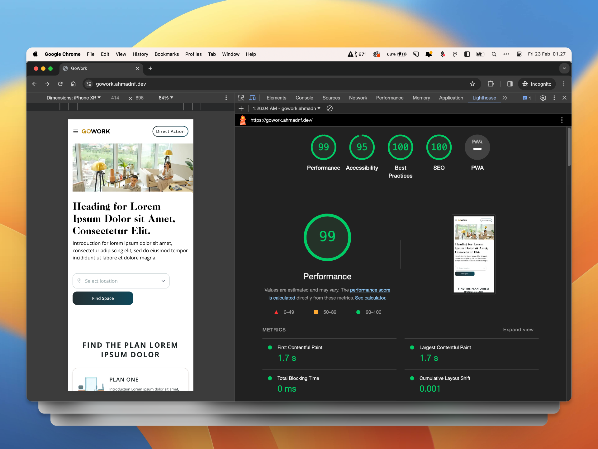

# GoWork Coding Test

This repository contains the codebase for the GoWork Coding Test. The project is built using the TALL stack, which includes Tailwind CSS, Alpine.js, Laravel, and Livewire.

---
### Live test: [https://gowork-fullstack.ahmadnf.dev](https://gowork-fullstack.ahmadnf.dev)
#### CMS & Book Feature Video Demo: [https://www.youtube.com/watch?v=F-Yt_r9fx0o](https://www.youtube.com/watch?v=F-Yt_r9fx0o)

##### Login CMS:
- URL: [https://gowork-fullstack.ahmadnf.dev/admin](https://gowork-fullstack.ahmadnf.dev/admin)
- Email: test@gowork.com
- Password: test1234
---
## Tech Stack

- **Tailwind CSS**: A utility-first CSS framework for building modern designs.
- **Alpine.js**: A minimal JavaScript framework for declarative UI.
- **Laravel**: A PHP web application framework known for its elegant syntax and tools for tasks common in modern web development.
- **Livewire**: A full-stack framework for Laravel that makes building dynamic interfaces simple.
- **FilamentPHP**

## Installation

1. Clone the repository:
```bash
  git clone https://github.com/ahmadnurfadilah/gowork-test
```

2. Navigate to the project directory:
```bash
  cd gowork-test
```

3. Install PHP & JavaScript dependencies:
```bash
  composer install && npm install
```

4. Build assets
```bash
  npm run dev
```

5. Set up your environment variables:
```bash
  cp .env.example .env
  php artisan key:generate
```

6. Run migrations and seed the database:
```bash
  php artisan migrate --seed
```

7. Start the development server:
```bash
  php artisan serve
```

Visit http://localhost:8000 in your browser.

## Lighthouse Score



